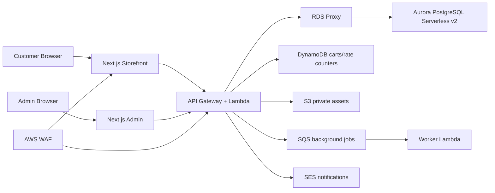
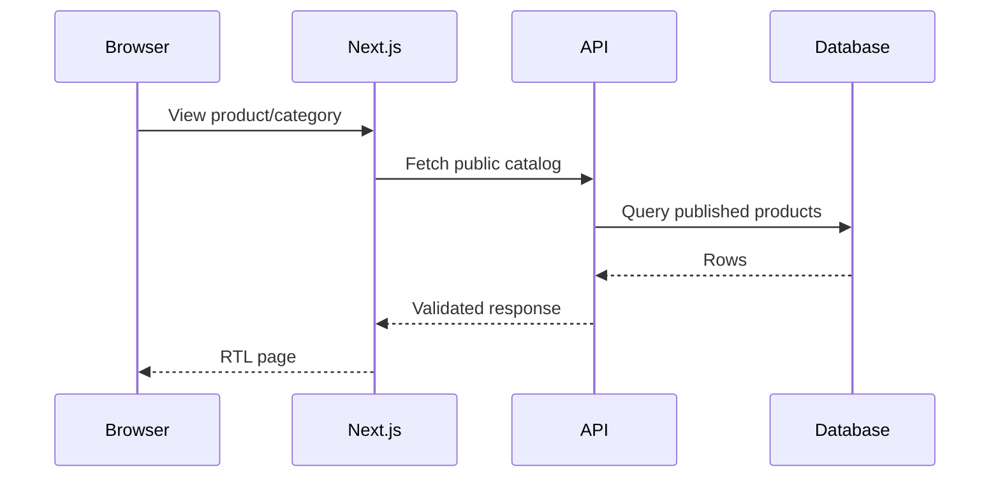
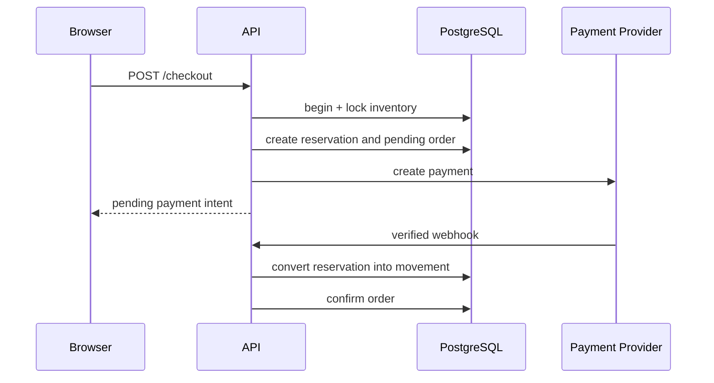
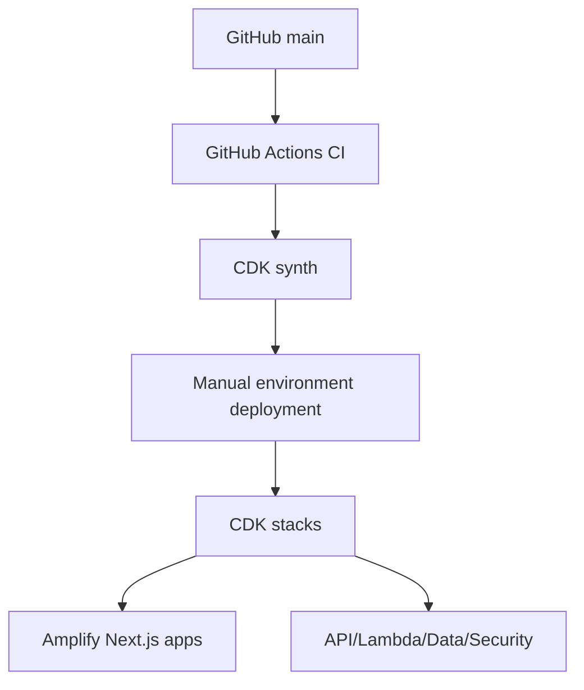

# Architecture

```mermaid
flowchart LR
  User["Customer Browser"] --> Storefront["Next.js Storefront"]
  AdminUser["Admin Browser"] --> Admin["Next.js Admin"]
  Storefront --> Api["API Gateway + Lambda"]
  Admin --> Api
  Api --> RdsProxy["RDS Proxy"]
  RdsProxy --> Aurora["Aurora PostgreSQL Serverless v2"]
  Api --> Dynamo["DynamoDB carts/rate counters"]
  Api --> S3["S3 private assets"]
  Api --> SQS["SQS background jobs"]
  SQS --> Worker["Worker Lambda"]
  Api --> SES["SES notifications"]
  WAF["AWS WAF"] --> Storefront
  WAF --> Api
```

## Request Lifecycle

```mermaid
sequenceDiagram
  participant B as Browser
  participant N as Next.js
  participant A as API
  participant D as Database
  B->>N: View product/category
  N->>A: Fetch public catalog
  A->>D: Query published products
  D-->>A: Rows
  A-->>N: Validated response
  N-->>B: RTL page
```

## Checkout Sequence

```mermaid
sequenceDiagram
  participant B as Browser
  participant A as API
  participant DB as PostgreSQL
  participant P as Payment Provider
  B->>A: POST /checkout
  A->>DB: begin + lock inventory
  A->>DB: create reservation and pending order
  A->>P: create payment
  A-->>B: pending payment intent
  P->>A: verified webhook
  A->>DB: convert reservation into movement
  A->>DB: confirm order
```

## Deployment

```mermaid
flowchart TD
  GitHub["GitHub main"] --> CI["GitHub Actions CI"]
  CI --> Synth["CDK synth"]
  Synth --> Deploy["Manual environment deployment"]
  Deploy --> Stacks["CDK stacks"]
  Stacks --> Amplify["Amplify Next.js apps"]
  Stacks --> Api["API/Lambda/Data/Security"]
```
