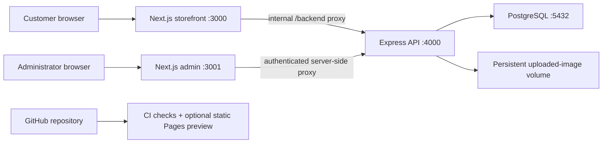
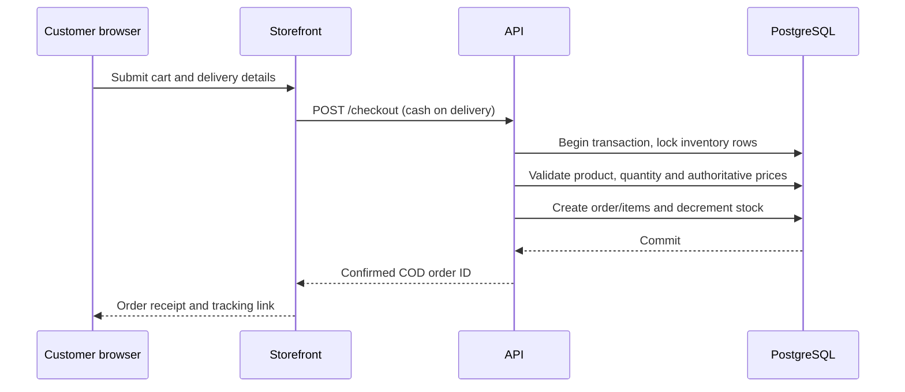

# Local Architecture

The application uses regular Next.js/Node.js processes and PostgreSQL. Docker Compose coordinates the services on one Ubuntu host.

The API and PostgreSQL ports are private to the Docker network; only the storefront and admin HTTP ports are published. Restrict access to a trusted LAN until TLS is configured.

## Checkout (current implementation)

Cancellation from the admin panel restores the ordered inventory. Card payment providers and shipping carriers are not integrated.

## Deployment

Use `compose.yaml` for the entire stack, or `docker-compose.yml` for a development-only PostgreSQL service while running Node.js processes on the host. See [Ubuntu deployment](ubuntu-docker.md).
